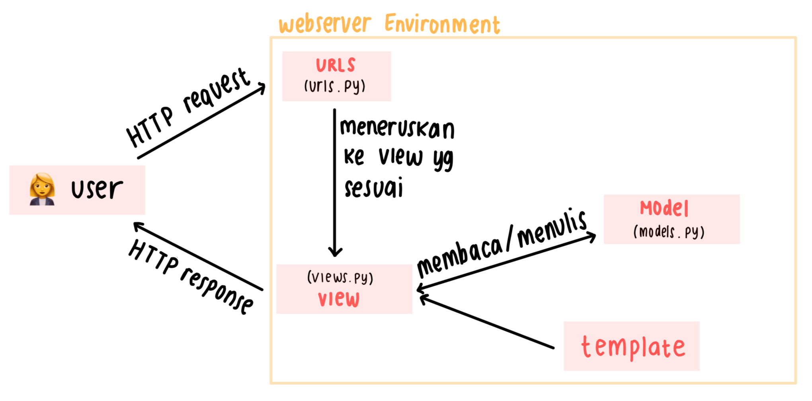
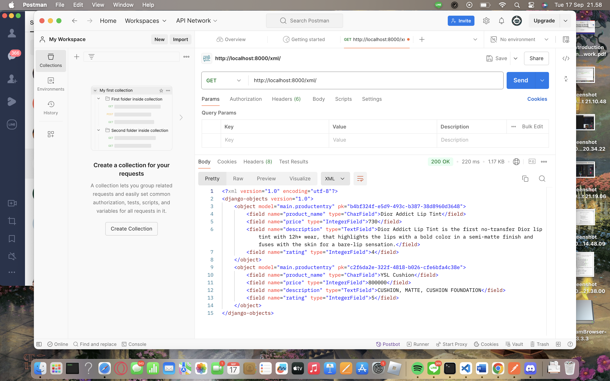
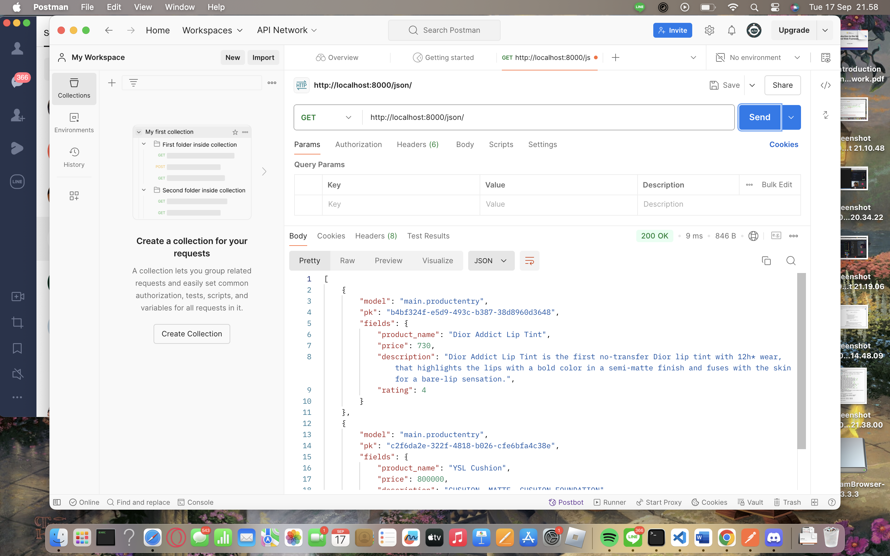
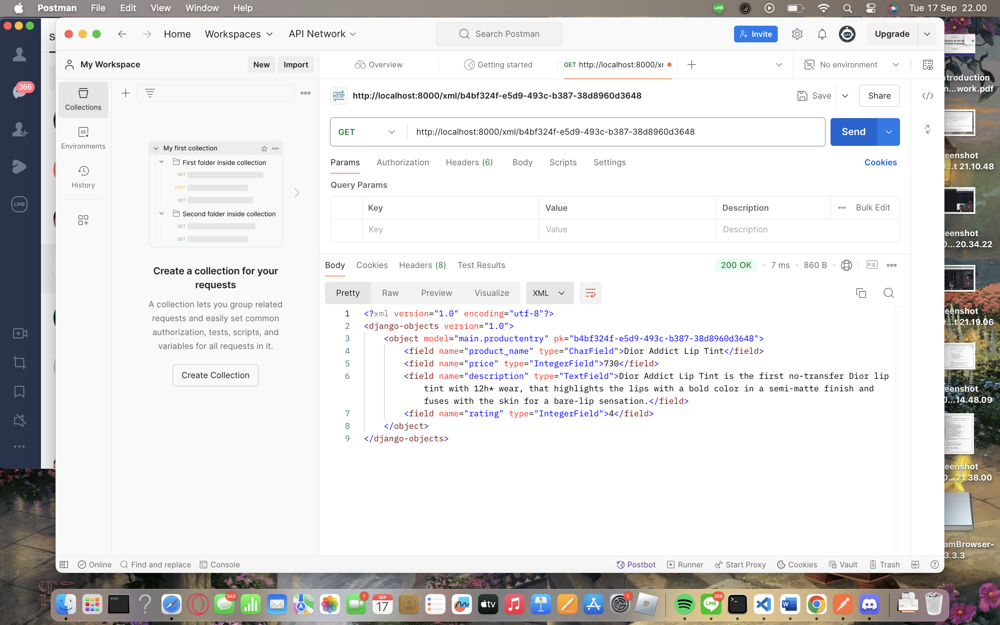
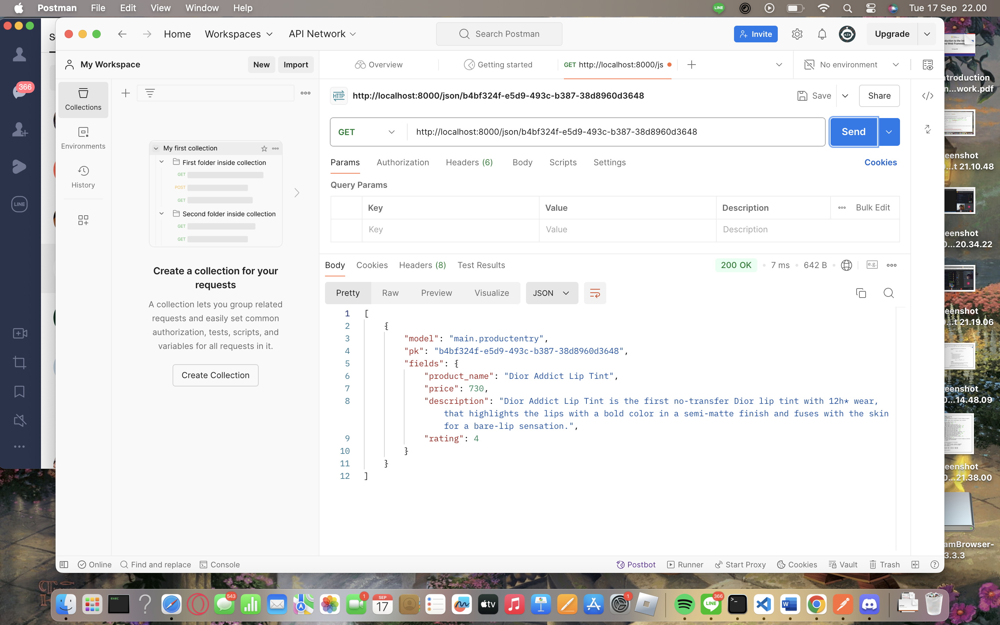

# ShopKint

**Nama : Shabrina Aulia Kinanti**
**NPM : 2306245472**
**Kelas : B**
> **Shopkint:** http://shabrina-aulia31-shopkint.pbp.cs.ui.ac.id

## **Penjelasan Tugas**
<details>
<summary> <b> Tugas 2: Implementasi Model-View-Template (MVT) pada Django </b> </summary>

## **Checklist Tugas**
* ### Membuat proyek django baru
1. Membuat direktori baru yang bernama shopkint lalu jalankan virtual environment yang ditandai dengan (env)
2. Pada direktori shopkint buat file baru bertama `requirments.txt` dan tambahkan dependencies (komponen atau modul agar perangkat lunaknya berfungsi, termasuk library, framework dan package) yang berisi 

```
django
gunicorn
whitenoise
psycopg2-binary
requests
urllib3
```
3. Intalasi terhadap dependencies dengan `pip install -r requirements.txt`
4. Buat proyek baru dengan tulisan `django-admin startproject shopkint .` di terminal direktori yang tadi
5. Django berhasil dibuat

* ### Membuat aplikasi dengan nama main pada proyek shopkint
1. Membuat repositori baru di github
2. Membuat branch utama baru dengan tulisan `git branch -M main` di terminal direktori
3. Tulis `git remote add origin https://github.com/shabrinaulia/shopkint.git` di terminal untuk menghubungkan repositori lokal dengan repositori di GitHub
4. Lakukan `git push -u origin main.` untuk menyimpan ke github
5. Jalankan perintah python manage.py startapp main di terminal. Folder main akan terbuat sebagai branch dari folder utama
6. Tambahkan main di variabel `INSTALLED_APPS` pada file `setting.py` di direkotori utama

* ### Melakukan routing pada proyek agar dapat menjalankan aplikasi main
1. Membuat file `urls.py` di folder main, lalu isi dengan 
```
from django.urls import path
from main.views import show_main

app_name = `main`

urlpatterns = [
    path(`, show_main, name=`show_main`),
]
```
2. Buka file urls.py pada folder shopkint lalu impor fungsi include dari django.urls
```
from django.contrib import admin
from django.urls import path, include

urlpatterns = [
    path(`, include(`main.urls`)),
]
```

* ### Membuat model pada aplikasi main
1. Pada `models.py` di main saya mengubah attribute dan datatypenya serta limitasi penulisan data typenya sesuai dengan ketentuan tugas
``` 
from django.db import models

class MoodEntry(models.Model):
    name = models.CharField(max_length=255)
    price = models.IntegerField()
    description = models.TextField()
    rating = models.IntegerField()
```
2. Jalankan `python manage.py makemigrations` untuk memberikan migrasi pada model data lalu lakukan `python manage.py migrate` untuk mengaplikasikan perubahan model ke basis data

* ### Membuat sebuah fungsi pada views.py 
1. Tambahkan import render pada file `views.py` di folder main
2. Menambahkan fungsi show_main dibawah impor untuk mengatur permintaan HTTP dan mengembalikan tampilan yang sesuai
3. Isi fungsinya dengan `context` yaitu dictionary yg berisi data
```
from django.shortcuts import render

# Create your views here.
def show_main(request):
    context = {
        `name` : `Liptint`,
        `price`: `600.000`,
        `description`: `NEW Liptint with high formula`,
        `rating` : `4.5/5.0`
    }

    return render(request, "main.html", context)
```
4. Return dengan format `return render(request, "main.html", context)`

* ### Membuat sebuah routing pada urls.py aplikasi main untuk memetakan fungsi yang telah dibuat pada views.py
1. Tulis code di file `urls.py` di folder main
```app_name = 'main'

urlpatterns = [
    path('', show_main, name='show_main'),
]
```
2. Buka file `urls.py` di folder shopkint tambahkan `from django.urls import path, include`
3. Pada variabel urlpatterns isi dengan  `path('', include('main.urls')),`

* ### Melakukan deployment ke PWS terhadap aplikasi yang sudah dibuat sehingga nantinya dapat diakses oleh teman-temanmu melalui Internet.
1. Buat project baru di PWS
2. Pada settings.py di folder shopkint pada variabel `ALLOWED_HOSTS` tambahkan `shabrina-aulia31-shopkint2.pbp.cs.ui.ac.id` 
3. Lakukan `git add, commit, push` ke github
4. Jalankan `git branch -M main`
5. Lalu jalankan `git push pws main:master`
6. Tunggu build lalu selesai

* ### Membuat sebuah README.md yang berisi tautan menuju aplikasi PWS yang sudah di-deploy, serta jawaban dari beberapa pertanyaan berikut.
1. Buat file `README.md` 
2. Masukin link PWS
3. Jawab pertanyaannya

## **Bagan Request Client ke Web Aplikasi Django dan Responnya** 

Ketika Client (Browser/User) mengirimkan permintaan HTTP ke server, server tersebut memprosesnya dengan melakukan pemetaan URL melalui file urls.py. Setelah URL yang diminta ditemukan dan dipetakan, fungsi yang relevan dalam views.py dipanggil sesuai dengan permintaan URL tersebut. Fungsi tersebut kemudian mengembalikan respons HTTP dalam bentuk halaman HTML. Lalu, views.py akan mengambil data yang diperlukan dari models.py, lalu menyajikannya menggunakan template.


## **Fungsi Git dalam Pengembangan Perangkat Lunak**
Git adalah sistem kontrol versi yang digunakan untuk melacak perubahan dalam kode selama pengembangan perangkat lunak. Fungsinya yaitu 
menyimpan versi kode sebelumnya sehingga bisa kembali ke versi sebelumnya jika diperlukan, memungkinkan pengembang bekerja bersama pada
proyek yang sama tanpa konflik melalui fitur branching dan merging, memberikan penyimpanan aman bagi kode di repository, biasanya secara
remote.

## **Alasan Django Dijadikan Permulaan Pembelajaran Pengembangan Perangkat Lunak**
1. banyak fitur bawaan sehingga pengguna tidak perlu mencari atau mengkonfigurasi banyak library eksternal buat mendapatkan fitur" umum.
2. Memudahkan pengelolaan database tanpa perlu menulis SQL secara manual.
3. Memiliki komunitas yang besar dan aktif sehingga mudah untuk mencari bantuan untuk masalah para pengguna.

## **Mengapa Model pada Django Disebut sebagai ORM?**
Model pada Django disebut ORM karena memungkinkan pengembang 
berinteraksi dengan database menggunakan objek Python, bukan 
query SQL langsung. Setiap model merepresentasikan tabel dalam 
database, dan ORM dapat melakukan operasi database seperti query, 
insert, update, dan delete dengan metode python.
</details>

<details>
<summary> <b> Tugas 3: Implementasi Form dan Data Delivery pada Django </b> </summary>

## **Checklist Tugas**
## **Mengapa kita memerlukan data delivery dalam pengimplementasian sebuah platform?**
Data delivery merupakan proses pengiriman data antar berbagai 
komponen sistem, baik antar server, antar aplikasi, maupun antara 
klien dan server. Data delivery menjadi esensial karena tanpa 
proses ini, komunikasi antara komponen-komponen dalam arsitektur 
sistem tidak dapat berlangsung dengan baik. Alasan kita 
memerlukan data delivery adalah:
1. Interoperabilitas: Berbagai layanan dan aplikasi perlu saling 
berbagi data untuk berfungsi dengan baik. Misalnya, API yang 
menghubungkan frontend dengan backend atau aplikasi yang 
berkomunikasi dengan layanan eksternal.
2. Akses Data: Data yang dihasilkan atau diminta oleh pengguna 
perlu dikirimkan dari server ke client atau sebaliknya untuk 
menyediakan informasi yang dibutuhkan, seperti hasil pencarian, 
produk yang ditampilkan, dll.
3. Scalability: Dalam arsitektur microservices, data delivery 
memungkinkan berbagai komponen bekerja secara terpisah dan 
i-host pada server yang berbeda, yang meningkatkan skalabilitas 
aplikasi.
4. Sinkronisasi Data: Data delivery memungkinkan sinkronisasi 
antara database, aplikasi, atau pengguna untuk memastikan data 
yang dilihat atau diubah konsisten di seluruh platform.

## **Manakah yang lebih baik antara XML dan JSON? Mengapa JSON lebih populer dibandingkan XML?**
JSON umumnya dianggap lebih baik dalam konteks pertukaran data ringan, aplikasi web modern, dan API, terutama karena kesederhanaan, kecepatan, dan efisiensinya. XML tetap relevan untuk skenario yang memerlukan struktur data yang lebih kompleks dan validasi data yang ketat. Namun, untuk sebagian besar aplikasi berbasis web dan komunikasi data antara klien dan server, JSON lebih populer dan sering menjadi pilihan utama karena kemudahannya dalam penggunaan dan performa yang lebih cepat.

## **Jelaskan fungsi dari method is_valid() pada form Django dan mengapa kita membutuhkan method tersebut?**
Method `is_valid()` dalam Django digunakan untuk memeriksa apakah data yang dimasukkan ke dalam form sudah valid sesuai dengan aturan yang telah ditetapkan dalam form tersebut. Method ini penting karena memastikan bahwa data yang diterima sesuai dengan tipe dan format yang diharapkan, serta menangani kesalahan input pengguna dengan menyimpan data yang valid di `cleaned_data` dan memberikan pesan kesalahan pada atribut errors jika ada input yang tidak sesuai. Penggunaan `is_valid()` sangat krusial untuk mencegah bug dan error dalam aplikasi, menjaga keamanan dari serangan seperti injection atau XSS, serta memberikan pengalaman pengguna yang lebih baik dengan memberikan umpan balik atas kesalahan input. Validasi ini juga membantu memastikan bahwa hanya data yang valid dan aman yang diproses lebih lanjut oleh aplikasi.

## **Mengapa kita membutuhkan csrf_token saat membuat form di Django? Apa yang dapat terjadi jika kita tidak menambahkan csrf_token pada form Django? Bagaimana hal tersebut dapat dimanfaatkan oleh penyerang?**
`` adalah token yang berfungsi sebagai security. Token ini di-generate secara otomatis oleh Django untuk mencegah serangan berbahaya. Kita membutuhkan `csrf_token` saat membuat form di Django untuk melindungi aplikasi dari serangan Cross-Site Request Forgery (CSRF), di mana penyerang mencoba melakukan tindakan berbahaya atas nama pengguna tanpa sepengetahuan mereka.Jika kita tidak menambahkan `csrf_token`, aplikasi akan rentan terhadap serangan CSRF, memungkinkan penyerang mengirimkan permintaan atas nama pengguna yang telah login, seperti mengubah data atau melakukan transaksi berbahaya, tanpa terdeteksi sebagai tindakan ilegal oleh server. Token ini penting untuk menjaga keamanan dan integritas aplikasi Django.

## **Jelaskan bagaimana cara kamu mengimplementasikan checklist di atas secara step-by-step (bukan hanya sekadar mengikuti tutorial).**
* ### Pembuatan Form dan Validasi dengan is_valid()
1. Buat file baru `forms.py` lalu tambahkan code untuk membuat struktur form product
```
from django.forms import ModelForm
from main.models import ProductEntry

class ProductEntryForm(ModelForm):
    class Meta:
        model = ProductEntry
        fields = ["product_name", "price", "description", "rating"]
```
2. Pada file `views.py` di folder main tambahkan 
```
from django.shortcuts import render, redirect
from main.forms import ProductEntryForm
from main.models import ProductEntry
```
lalu buat fungsi baru bernama `create_product_entry` yang menerima request, tambahkan code ini 
```
def create_product_entry(request):
    form = MoodEntryForm(request.POST or None)

    if form.is_valid() and request.method == "POST":
        form.save()
        return redirect('main:show_main')

    context = {'form': form}
    return render(request, "create_product_entry.html", context)
```
3. Sesuaikan fungsi `show_main` di `views.py` menjadi
```
def show_main(request):
    mood_entries = MoodEntry.objects.all()
    context = {
        'name': 'Shabrina Aulia Kinanti',
        'npm' : '2306245472',
        'class': 'PBP B',
        'mood_entries': mood_entries
    }

    return render(request, "main.html", context)
```
4. Pada file `urls.py` saya menambahkan `from main.views import show_main, create_product_entry` lalu menambahkan path url di file `urls.py` bagian urlpatterns `path('create-product-entry', create_product_entry, name='create_product_entry'),`
5. Buat file HTML di bagian folder templates dengan nama `create_product_entry.html` berisi
```
 

<h1>Add New Product Entry</h1>

<form method="POST">
  
  <table>
    {{ form.as_table }}
    <tr>
      <td></td>
      <td>
        <input type="submit" value="Add New Product" />
      </td>
    </tr>
  </table>
</form>


```
6. Tambahkan code dibawah ini pada `main.html`serta tombol "Add New Product Entry" yang akan balik ke halaman form
```

<p>Belum ada data mengenai produk yang dijual.</p>

<table>
  <tr>
    <th>Product Name</th>
    <th>Price</th>
    <th>Description</th>
    <th>Rating</th>
  </tr>

   Berikut cara memperlihatkan data produk di bawah baris ini 
   
  
  <tr>
    <td>{{product_entry.product_name}}</td>
    <td>{{product_entry.price}}</td>
    <td>{{product_entry.description}}</td>
    <td>{{product_entry.rating}}</td>
  </tr>
  
</table>


<br />

<a href="">
  <button>Add New Product</button>
</a>

```

* ### Menambahkan 4 fungsi views baru untuk melihat objek yang sudah ditambahkan dalam format XML, JSON, XML by ID, dan JSON by ID.
Menagembalikan Data dalam Bentuk XML dan JSOON
1. Buka file `views.py` lalu tambahkan
```
from django.http import HttpResponse
from django.core import serializers
```
2. Menambahkan fungsi `show_xml` yang akan mengembalikan `HttpResponse` berisi data yang sudah menjadi XML
```
def show_xml(request):
    data = ProductEntry.objects.all()
    return HttpResponse(serializers.serialize("xml", data), content_type="application/xml")
```
Lalu tambahkan fungsi `show_json` yang akan mengembalikan
`HttpResponse` berisi data yang sudah menjadi JSON
```
def show_json(request):
    data = ProductEntry.objects.all()
    return HttpResponse(serializers.serialize("json", data), content_type="application/json")
```

Mengembalikan Data dalam Bentuk XML dan JSON Berdasarkan ID
1. Pada file `views.py` tambahkan fungsi `show_xml_by_id`yang akan mengembalikan `HttpResponse` berisi data yang sudah menjadi XML berdasarkan ID
```
def show_xml_by_id(request, id):
    data = ProductEntry.objects.filter(pk=id)
    return HttpResponse(serializers.serialize("xml", data), content_type="application/xml")
```
Lalu tambahkan fungsi `show_json_by_id`yang akan mengembalikan `HttpResponse` berisi data yang sudah menjadi JSON berdasarkan ID
```
def show_json_by_id(request, id):
    data = ProductEntry.objects.filter(pk=id)
    return HttpResponse(serializers.serialize("json", data), content_type="application/json")
```
* ### Membuat Routing URL pada Masing-Masing Views yang Telah Ditambahkan
1. Membuat routing URL setiap path di dalam `urlpatterns` menghubungkan URL yang spesifik dengan fungsi view tertentu sehingga bisa ditampilkan dalam format yang diminta (XML atau JSON) di `urls.py` yang berisi :
```
from django.urls import path
from main.views import show_main, create_product_entry, show_xml, show_json, show_xml_by_id, show_json_by_id

app_name = 'main'

urlpatterns = [
    path('', show_main, name='show_main'),
    path('create-product-entry', create_product_entry, name='create_product_entry'),
    path('xml/', show_xml, name='show_xml'),
    path('json/', show_json, name='show_json'),
    path('xml/<str:id>/', show_xml_by_id, name='show_xml_by_id'),
    path('json/<str:id>/', show_json_by_id, name='show_json_by_id'),
]
```
2. Jalanakan proyek dengan `python manage.py runserver` lalu buka `http://localhost:8000/xml/[id]/` atau json untuk melihat proyek yang sudah dibuat

## **Screenshot Hasil Akses URL pada Postman** 
1. XML

2. JSON

3. XML by ID

4. JSON by ID


</details>

<details>
<summary> <b> Tugas 4: Implementasi Autentikasi, Session, dan Cookies pada Django </b> </summary>

## **Checklist Tugas**
## **Apa perbedaan antara HttpResponseRedirect() dan redirect()**
HttpResponseRedirect() adalah sebuah kelas yang digunakan untuk melakukan redirect secara manual ke URL tertentu. redirect() adalah shortcut yang lebih mudah digunakan, karena bisa menerima URL, nama view, atau objek sebagai argumen.

## **Jelaskan cara kerja penghubungan model Product dengan User!**
Model Product memiliki ForeignKey yang menghubungkannya dengan model User, memungkinkan setiap produk untuk dimiliki oleh satu pengguna. Dengan ini, produk bisa ditautkan secara spesifik kepada pengguna yang terdaftar di aplikasi.

## **Apa perbedaan antara authentication dan authorization, apakah yang dilakukan saat pengguna login? Jelaskan bagaimana Django mengimplementasikan kedua konsep tersebut.**
Authentication adalah proses memverifikasi identitas pengguna (contohnya, memeriksa apakah username dan password benar). Authorization adalah proses menentukan apakah pengguna yang sudah di-authenticate memiliki izin untuk mengakses sumber daya tertentu. Saat pengguna login, yang dilakukan adalah authentication, yaitu memastikan pengguna terdaftar dengan kredensial yang benar. Django menggunakan middleware untuk mengelola session dan cookies guna mengingat status login pengguna.

## **Bagaimana Django mengingat pengguna yang telah login? Jelaskan kegunaan lain dari cookies dan apakah semua cookies aman digunakan?**
Django mengingat pengguna yang telah login menggunakan session framework, dengan menyimpan session ID unik sebagai cookie di browser pengguna. Cookies juga digunakan untuk menyimpan preferensi pengguna dan melacak aktivitas mereka. Untuk menjaga keamanan, cookies sebaiknya diberi flag HttpOnly dan secure agar tidak mudah diakses oleh skrip atau koneksi yang tidak aman. Penggunaan cookies secara default dapat aman jika developer mengikuti praktik terbaik. Namun, pengunaan cookie juga tetap memilki risiko potensial seperti :
1. Cross-Site Scripting (XSS): Serangan XSS dapat memungkinkan pencurian cookies dari pengguna jika tidak ada validasi input yang baik.
2. Cross-Site Request Forgery (CSRF): Serangan CSRF dapat memungkinkan pihak ketiga untuk membuat request yang berbahaya atas nama pengguna. Django sudah menyertakan perlindungan CSRF secara default.
3. Session Hijacking: Jika cookie tidak dienkripsi dengan baik, sesi pengguna bisa dicuri oleh pihak ketiga.

## **Jelaskan bagaimana cara kamu mengimplementasikan checklist di atas secara step-by-step (bukan hanya sekadar mengikuti tutorial)**
* ### Mengimplementasikan fungsi registrasi, login, dan logout
1. Tambahkan import `UserCreationForm` dan `messages` pada file `views.py` di folder main
```
from django.contrib.auth.forms import UserCreationForm
from django.contrib import messages
```
2. Tambahkan fungsi `register` masih di file yang sama 
```
def register(request):
    form = UserCreationForm()

    if request.method == "POST":
        form = UserCreationForm(request.POST)
        if form.is_valid():
            form.save()
            messages.success(request, 'Your account has been successfully created!')
            return redirect('main:login')
    context = {'form':form}
    return render(request, 'register.html', context)
```
3. Membuat file baru bernama `register.html` di folder main bagian templates yang berisikan
```
def register(request):
    form = UserCreationForm()

    if request.method == "POST":
        form = UserCreationForm(request.POST)
        if form.is_valid():
            form.save()
            messages.success(request, 'Your account has been successfully created!')
            return redirect('main:login')
    context = {'form':form}
    return render(request, 'register.html', context)
```
4. Menambahkan import fungsi register dan juga path urlnya di file `urls.py`
```
from main.views import register
...
 urlpatterns = [
     ...
     path('register/', register, name='register'),
 ]
```

**login**
5. Saya membuat view login_user di `views.py` menggunakan AuthenticationForm dan metode authenticate serta login dari Django
```
from django.contrib.auth.forms import UserCreationForm, AuthenticationForm
from django.contrib.auth import authenticate, login

def login_user(request):
    if request.method == 'POST':
        form = AuthenticationForm(data=request.POST)
        if form.is_valid():
            user = form.get_user()
            login(request, user)
            return redirect('main:show_main')
    else:
        form = AuthenticationForm()
    context = {'form': form}
    return render(request, 'login.html', context)
```
6. Membuat file `login.html` di folder main/templates berisi 
```



<title>Login</title>



<div class="login">
  <h1>Login</h1>

  <form method="POST" action="">
    
    <table>
      {{ form.as_table }}
      <tr>
        <td></td>
        <td><input class="btn login_btn" type="submit" value="Login" /></td>
      </tr>
    </table>
  </form>

  
  <ul>
    
    <li>{{ message }}</li>
    
  </ul>
   Don't have an account yet?
  <a href="">Register Now</a>
</div>


```
7. Menambahkan import di file `urls.py` seperti `from main.views import login_user` dan menambahkan path nya dalam `urlpatterns` serperti `path('login/', login_user, name='login'),`

**logout**
8. Menambahkan import `logout` di `views.py` dengan fungsi logout `from django.contrib.auth import logout` lalu tambahkan fungsi 
``` 
def logout_user(request):
    logout(request)
    return redirect('main:login')
```
9. Tambahkan potongan kode di file `main.html`
```
<a href="">
  <button>Logout</button>
</a>
```
10. Menambahkan import di file `urls.py` seperti `from main.views import logout_user` dan menambahkan path nya dalam `urlpatterns` serperti `path('logout/', logout_user, name='logout'),`

* ### Menghubungkan model Product dengan User
1. Buka file `models.py` terus tambahkan import code `from django.contrib.auth.models import User` llau di class `ProductEntry` tambahin `user = models.ForeignKey(User, on_delete=models.CASCADE)`
2. Lalu tambahkan code ini di fungsi `create_product_entry` di file `views.py`
```
def create_mood_entry(request):
    form = MoodEntryForm(request.POST or None)

    if form.is_valid() and request.method == "POST":
        mood_entry = form.save(commit=False)
        mood_entry.user = request.user
        mood_entry.save()
        return redirect('main:show_main')

    context = {'form': form}
    return render(request, "create_mood_entry.html", context)
```
3. Ubah value dr `product_entries` dan `context` di fungsi `shoe_main` lalu nanti di migrate
```
def show_main(request):
    product_entries = ProductEntry.objects.filter(user=request.user)

    context = {
         'name': request.user.username,
    }
```
4. Lalu seetelah itu tamabahin import os di `settings.py`trs ganti variabel debug nya jadi 
```
PRODUCTION = os.getenv("PRODUCTION", False)
DEBUG = not PRODUCTION
```

* ### Pengelolaan Sesi dengan Cookies
1. Setelah login, saya menambahkan cookie last_login untuk menyimpan data waktu terakhir login. Pada file `views.py` bagian login_user, saya mengubah response untuk menyertakan cookie
```
from django.http import HttpResponseRedirect
import datetime

def login_user(request):
    if request.method == 'POST':
        form = AuthenticationForm(data=request.POST)
        if form.is_valid():
            user = form.get_user()
            login(request, user)
            response = HttpResponseRedirect(reverse("main:show_main"))
            response.set_cookie('last_login', str(datetime.datetime.now()))
            return response
    else:
        form = AuthenticationForm()
    return render(request, 'login.html', {'form': form})
```
2. Di file `views.py` pada bagian `show_main`, saya menambahkan context untuk menampilkan last_login dari cookies
```
def show_main(request):
    context = {
        'name': request.user.username,
        'last_login': request.COOKIES.get('last_login', 'Unknown')
    }
    return render(request, 'main.html', context)
```

* ### Keamanan Cookies
1. Saya memastikan bahwa cookie disetel dengan atribut `HttpOnly` dan `Secure` jika menggunakan HTTPS
```
response.set_cookie('last_login', str(datetime.datetime.now()), httponly=True, secure=True)
```
2. Lalu mengecek untuk memastikan cookie tidak dapat diakses oleh JavaScript dan hanya dikirim melalui koneksi HTTPS.

